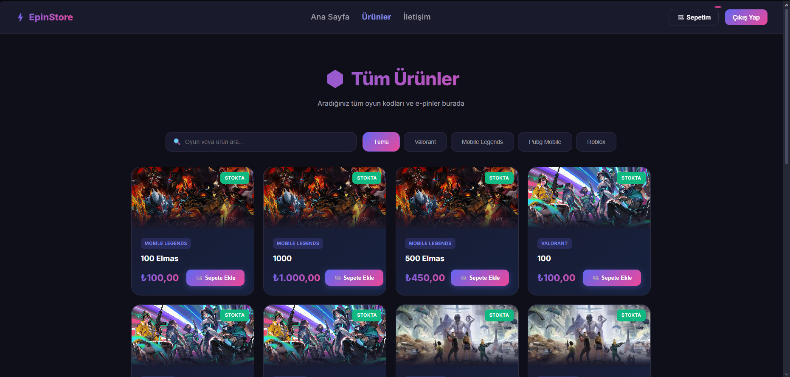
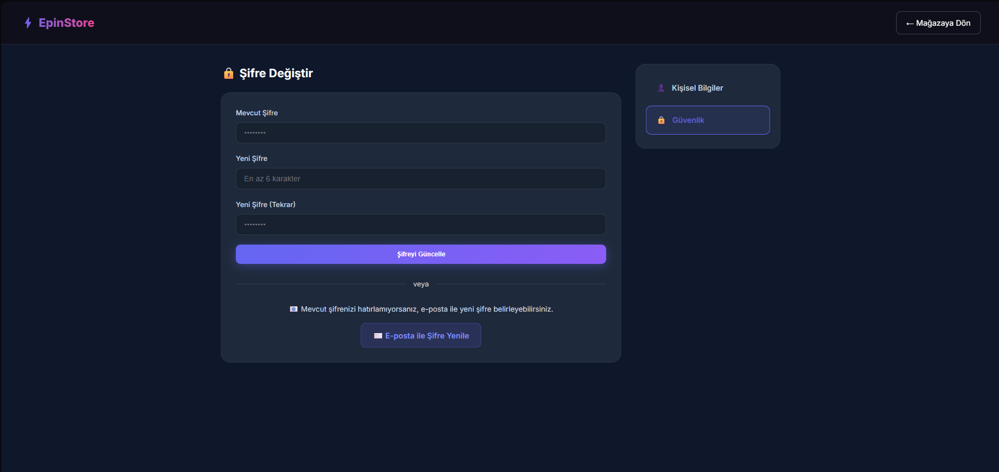
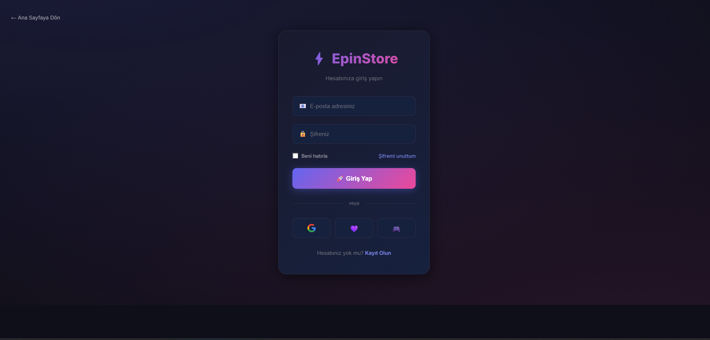
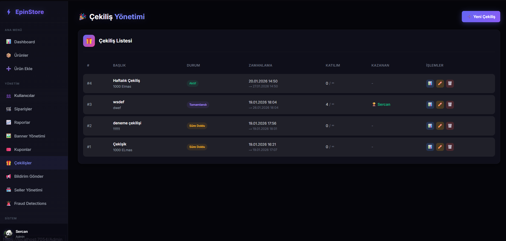
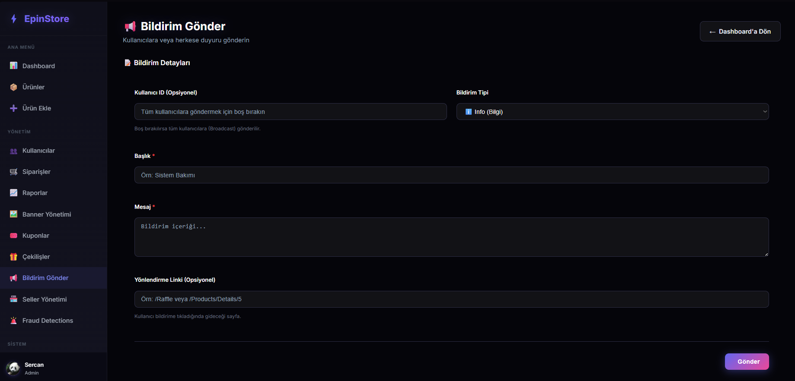
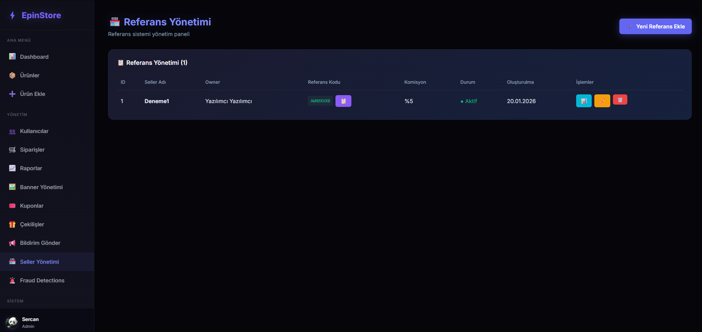
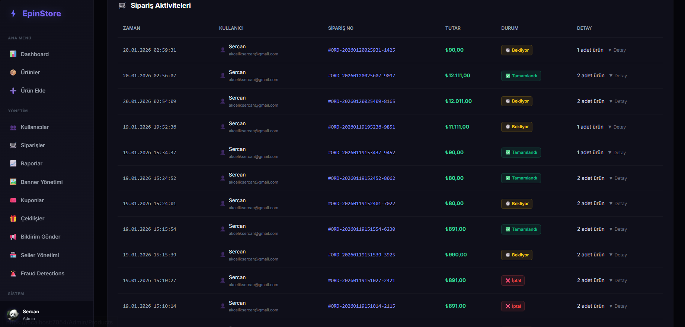

# Screenshots

Bu klasörde projenin ekran görüntüleri yer almaktadır.

## 🎨 Kullanıcı Arayüzü

### Ana Sayfa

### Ürün Sayfaları

### Çekilişler

### Sepet & Ödeme

---

## 👤 Kullanıcı Paneli

### Profil

### Güvenlik

### Giriş

---

## ⚙️ Admin Panel

### Dashboard

### Ürün Yönetimi

### Kullanıcı Yönetimi

### Sipariş Yönetimi

### Raporlar

### Banner Yönetimi

### Kupon Yönetimi

### Çekiliş Yönetimi

### Bildirim Sistemi

### Referans/Bayi Sistemi

### Site Ayarları

### Sipariş Aktiviteleri

---

> 📌 **Not:** Bu ekran görüntüleri geliştirme ortamından alınmıştır.
