# 🎮 Epin Mağaza Sistemi - Kapsamlı Teknik Dokümantasyon

> **Dijital Ürün Satış Platformu** | ASP.NET Core MVC | Entity Framework Core | SQL Server

---

## 📋 İçindekiler

1. [Genel Bakış](#-genel-bakış)
2. [Sistem Mimarisi](#-sistem-mimarisi)
3. [Veritabanı Şeması](#-veritabanı-şeması)
4. [Modüller ve Sistemler](#-modüller-ve-sistemler)
5. [API ve Entegrasyonlar](#-api-ve-entegrasyonlar)
6. [Güvenlik](#-güvenlik)
7. [Dosya Yapısı](#-dosya-yapısı)

---

## 🎯 Genel Bakış

Epin Mağaza Sistemi, dijital oyun kodları (E-pin) satışı için geliştirilmiş profesyonel bir e-ticaret platformudur.

### Temel Özellikler

| Özellik | Açıklama |
|---------|----------|
| 🛒 **E-pin Satışı** | Dijital oyun kodlarının güvenli satışı ve teslimi |
| 💳 **Ödeme Entegrasyonu** | Iyzico 3D Secure ödeme altyapısı |
| 👥 **Kullanıcı Yönetimi** | Rol tabanlı erişim kontrolü (Admin, Customer, Seller) |
| 🎁 **Çekiliş Sistemi** | Otomatik veya manuel çekiliş yönetimi |
| 🏷️ **Kupon Sistemi** | Yüzde veya sabit indirim kuponları |
| 📊 **Referans Sistemi** | Bayi/Satıcı komisyon takibi |
| 📢 **Bildirim Sistemi** | Kullanıcılara anlık bildirimler |
| 🎠 **Banner Yönetimi** | Dinamik görsel ve video bannerlar |

---

## 🏗 Sistem Mimarisi

### Uygulama Katmanları

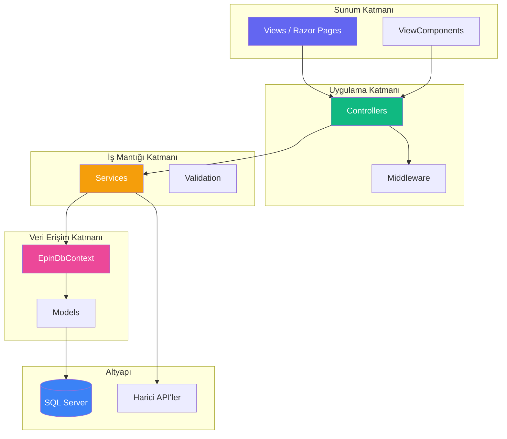

### Controller Yapısı

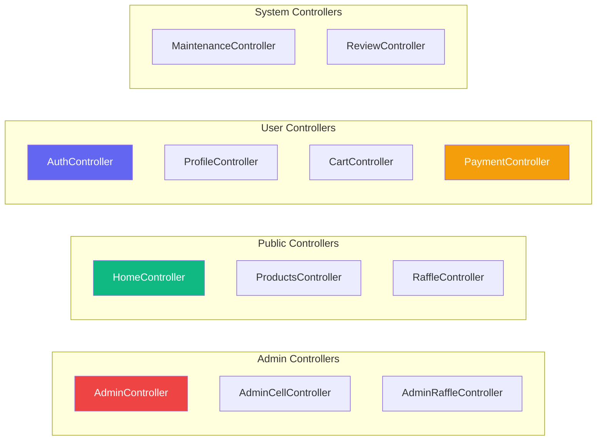

### Servis Bağımlılıkları

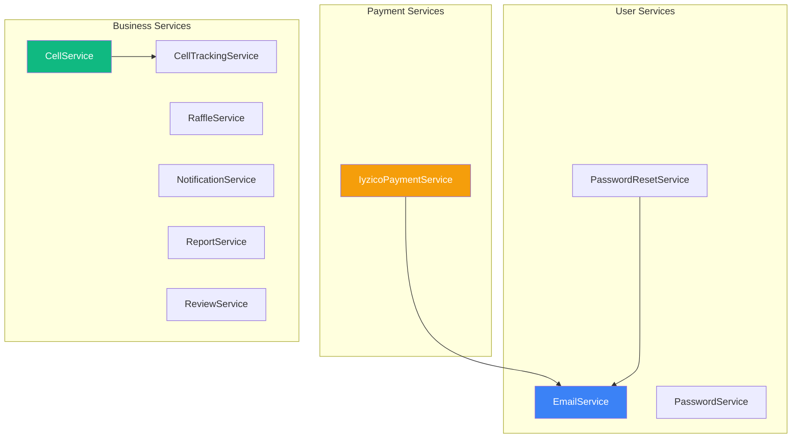

---

## 💾 Veritabanı Şeması

### Ana Tablolar İlişki Diyagramı

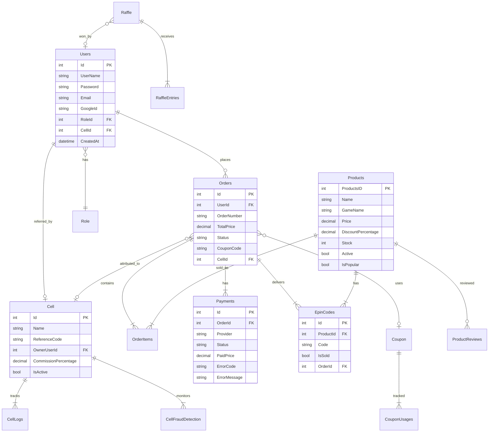

### Ödeme ve Sipariş Akışı

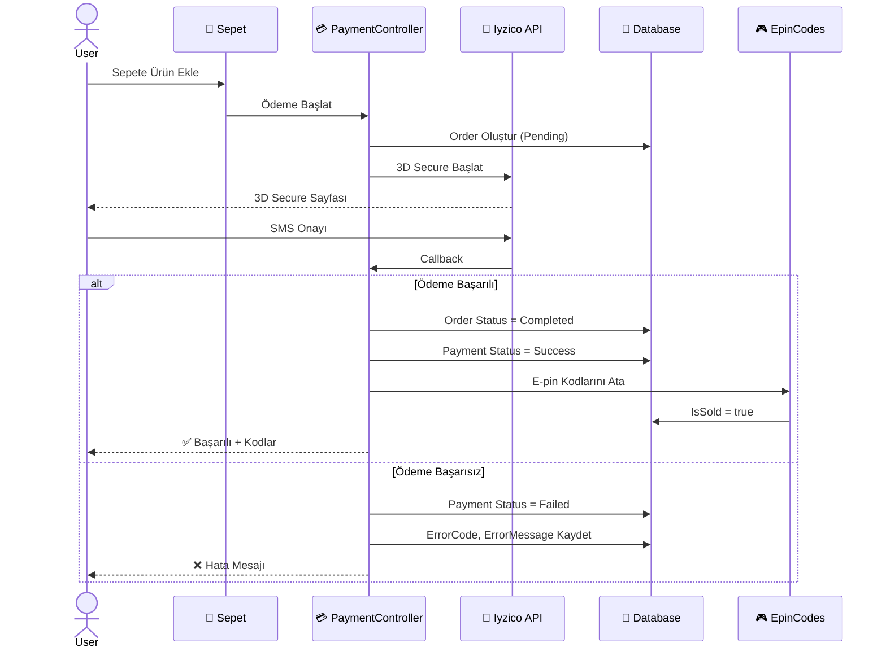

---

## 🧩 Modüller ve Sistemler

### 1. 🔐 Kimlik Doğrulama Sistemi

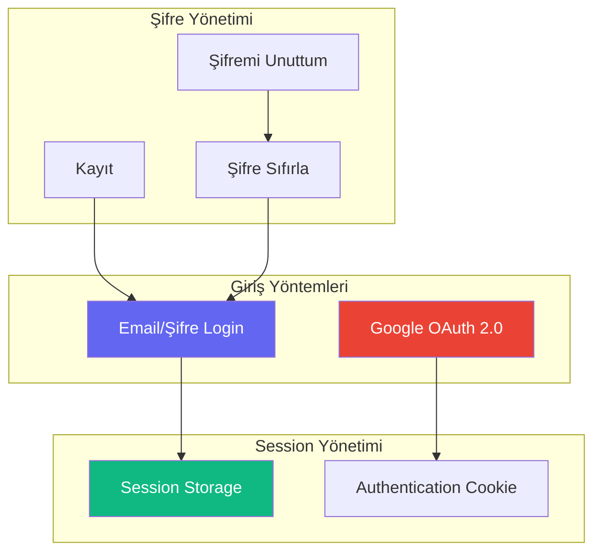

**Özellikler:**
- ✅ Email/Şifre ile klasik giriş
- ✅ Google OAuth 2.0 entegrasyonu
- ✅ BCrypt ile şifre hashleme
- ✅ Şifremi unuttum email akışı
- ✅ 30 dakika session timeout
- ✅ Rol tabanlı erişim (Admin, Customer, Seller)

---

### 2. 💳 Ödeme Sistemi (Iyzico)

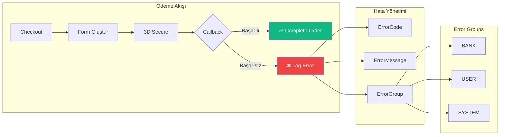

**Özellikler:**
- ✅ Iyzico 3D Secure entegrasyonu
- ✅ Detaylı hata loglama (Bank/User/System)
- ✅ Kupon indirim entegrasyonu
- ✅ Otomatik E-pin teslimi
- ✅ Ödeme geçmişi raporlama

---

### 3. 🎁 Çekiliş Sistemi (Raffle)

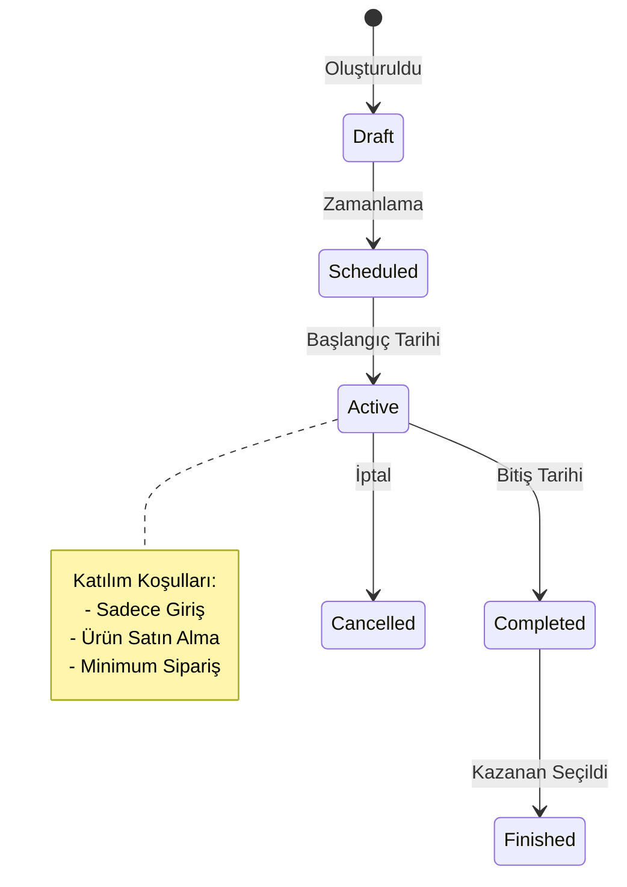

**Katılım Türleri:**

| Tür | Açıklama |
|-----|----------|
| `LoginOnly` | Sadece giriş yapan kullanıcılar |
| `ProductPurchase` | Belirli ürünü satın alanlar |
| `MinOrderCount` | Minimum sipariş sayısına ulaşanlar |

---

### 4. 🏷️ Kupon Sistemi

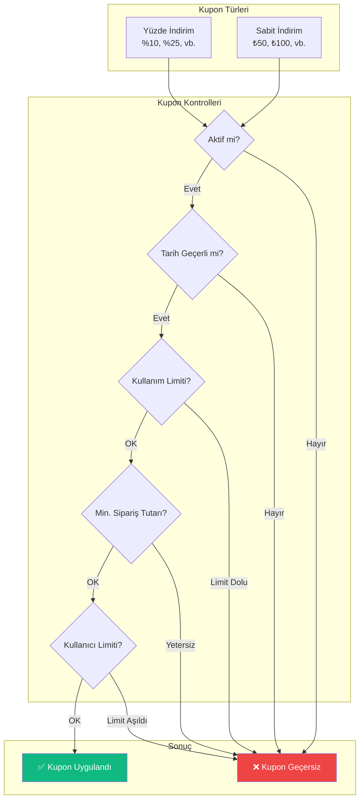

---

### 5. 📊 Referans/Bayi Sistemi (Cell)

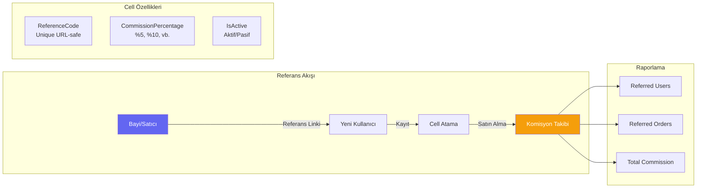

**Cell Log Türleri:**
- `UserRegistration` - Yeni kullanıcı kaydı
- `OrderCreation` - Sipariş oluşturma
- `Commission` - Komisyon hesaplama

---

### 6. 🎠 Banner Yönetimi

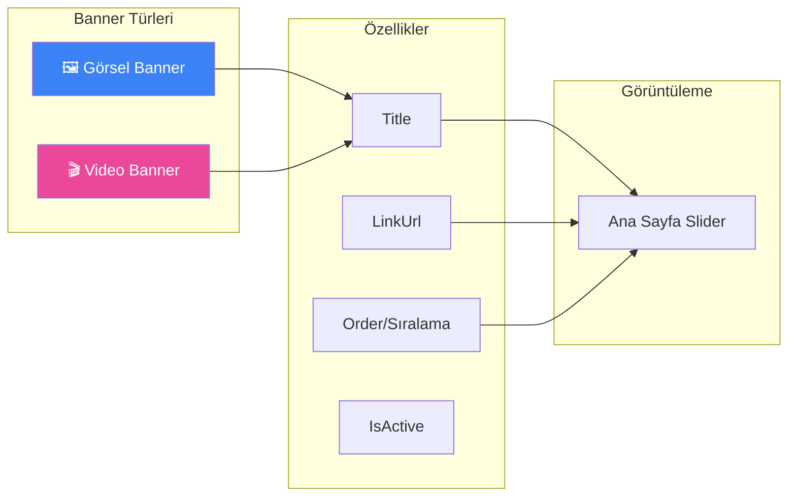

---

## 🔌 API ve Entegrasyonlar

### Harici Servisler

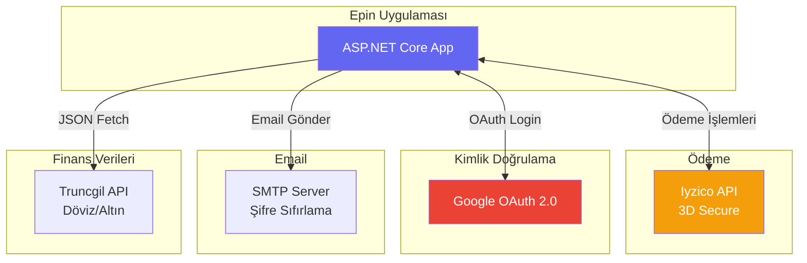

### Admin Dashboard API'leri

| Endpoint | Kaynak | Veri |
|----------|--------|------|
| `/Admin` | Truncgil | USD, EUR, Gram Altın |
| Dashboard | Internal | Satış grafikleri, istatistikler |

---

## 🔒 Güvenlik

### Güvenlik Katmanları

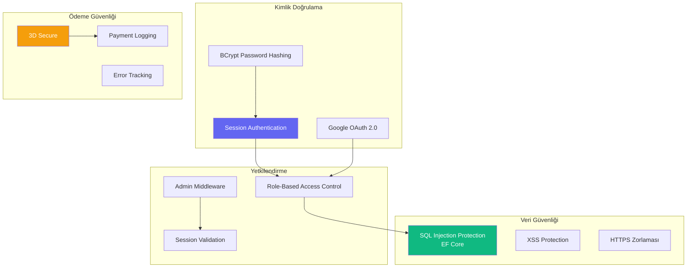

### Rol Tabanlı Erişim

| Rol | ID | Yetkiler |
|-----|----|----|
| **Admin** | 1 | Tüm yetkiler, Panel erişimi |
| **Customer** | 2 | Satın alma, Profil yönetimi |
| **Seller** | 3 | Cell yönetimi, Komisyon takibi |

---

## 📁 Dosya Yapısı

```
Epin/
├── 📁 Controllers/           # MVC Controller'lar
│   ├── AdminController.cs        # Admin dashboard
│   ├── AdminCellController.cs    # Referans yönetimi
│   ├── AdminRaffleController.cs  # Çekiliş yönetimi
│   ├── AuthController.cs         # Kimlik doğrulama
│   ├── CartController.cs         # Sepet işlemleri
│   ├── HomeController.cs         # Ana sayfa
│   ├── PaymentController.cs      # Ödeme işlemleri
│   ├── ProductsController.cs     # Ürün yönetimi
│   ├── ProfileController.cs      # Kullanıcı profili
│   ├── RaffleController.cs       # Çekiliş katılım
│   └── ReviewController.cs       # Ürün yorumları
│
├── 📁 Models/                # Veri modelleri
│   ├── Users.cs                  # Kullanıcı modeli
│   ├── Product.cs                # Ürün modeli
│   ├── Order.cs                  # Sipariş modeli
│   ├── Payment.cs                # Ödeme modeli
│   ├── EpinCode.cs               # E-pin kodları
│   ├── Cell.cs                   # Referans sistemi
│   ├── Raffle.cs                 # Çekiliş modeli
│   ├── Coupon.cs                 # Kupon modeli
│   ├── Banner.cs                 # Banner modeli
│   └── ...                       # Diğer modeller
│
├── 📁 Services/              # İş mantığı servisleri
│   ├── IyzicoPaymentService.cs   # Iyzico entegrasyonu
│   ├── CellService.cs            # Referans servisi
│   ├── RaffleService.cs          # Çekiliş servisi
│   ├── NotificationService.cs    # Bildirim servisi
│   ├── EmailService.cs           # Email servisi
│   └── ...                       # Diğer servisler
│
├── 📁 Views/                 # Razor Views
│   ├── 📁 Admin/                 # Admin panel sayfaları
│   ├── 📁 Auth/                  # Giriş/Kayıt sayfaları
│   ├── 📁 Products/              # Ürün sayfaları
│   ├── 📁 Shared/                # Layout ve partial'lar
│   └── ...
│
├── 📁 Data/                  # Veritabanı context
│   └── EpinDbContext.cs
│
├── 📁 Middleware/            # Custom middleware
│   └── MaintenanceMiddleware.cs
│
├── 📁 wwwroot/               # Statik dosyalar
│   ├── 📁 css/
│   ├── 📁 js/
│   ├── 📁 images/
│   └── 📁 uploads/
│
├── Program.cs                # Uygulama entry point
└── appsettings.json          # Konfigürasyon
```

---

## 📈 Raporlama ve İstatistikler

### Dashboard Metrikleri

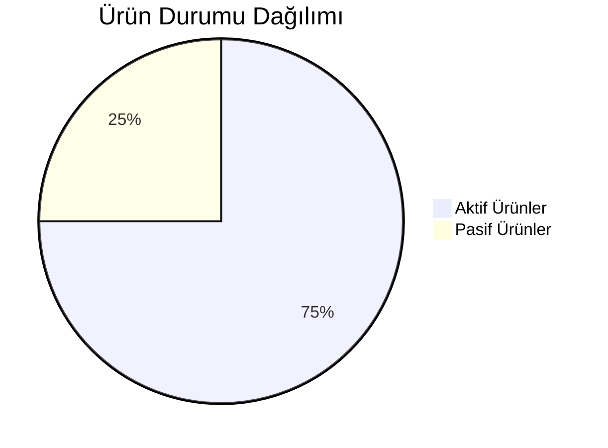

### Admin Panel Özellikleri

- 📊 Son 7 günlük satış grafikleri
- 🎮 Oyunlara göre ürün dağılımı
- 💰 Gerçek zamanlı döviz/altın kurları
- 👥 Kayıtlı kullanıcı sayısı
- 📦 Stok durumu takibi
- 💳 Başarısız ödeme analizi

---

## 🚀 Kurulum ve Çalıştırma

### Gereksinimler

- .NET 8.0 SDK
- SQL Server 2019+
- Visual Studio 2022 / VS Code

### Konfigürasyon

```json
{
  "ConnectionStrings": {
    "DefaultConnection": "Server=...;Database=Epin;..."
  },
  "Authentication": {
    "Google": {
      "ClientId": "...",
      "ClientSecret": "..."
    }
  },
  "Iyzico": {
    "ApiKey": "...",
    "SecretKey": "...",
    "BaseUrl": "https://api.iyzipay.com"
  }
}
```

### Çalıştırma

```bash
# Veritabanı migration
dotnet ef database update

# Uygulamayı başlat
dotnet run
```

---

## 📝 Notlar

> [!IMPORTANT]
> Bu proje production-ready bir e-ticaret platformudur. Tüm ödeme işlemleri 3D Secure ile güvence altındadır.

> [!TIP]
> Admin panelindeki döviz kurları, birden fazla proxy kaynağından otomatik olarak çekilmektedir.

---

**Son Güncelleme:** Ocak 2026  
**Versiyon:** 1.0.0
