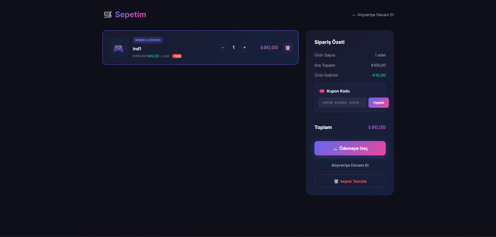
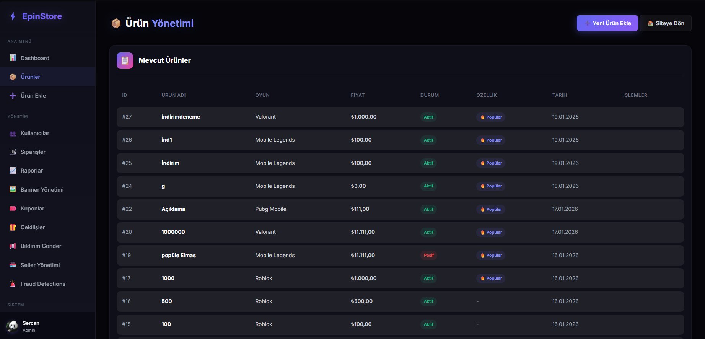
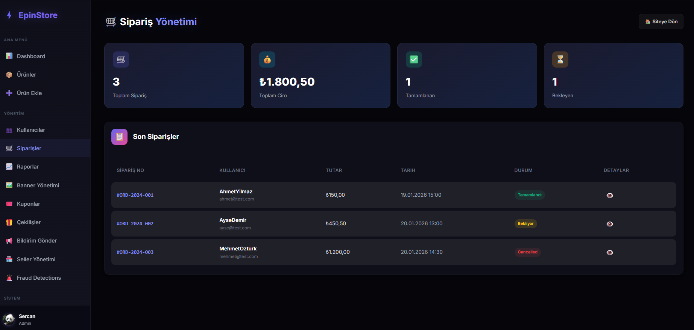

# 🎮 EPIN Marketplace

### Modern • Güvenli • Profesyonel

Dijital oyun kodları (E-pin, CD Key, Game Pass) satışı için geliştirilmiş profesyonel e-ticaret platformu.

[Özellikler](#-özellikler) • [Mimari](#️-mimari) • [Ekran Görüntüleri](#-ekran-görüntüleri) • [Teknolojiler](#-teknolojiler)

> ⚠️ **Bu repository showcase amaçlıdır. Kaynak kod özeldir.**

---

## 🎯 Proje Hakkında

EPIN Marketplace, dijital ürün satışı için tasarlanmış kapsamlı bir e-ticaret sistemidir. Iyzico 3D Secure ödeme entegrasyonu, Google OAuth kimlik doğrulama, rol tabanlı yetkilendirme ve tam özellikli admin paneli içermektedir.

---

## ✨ Özellikler

### 🛒 E-ticaret Sistemi
- Ürün listeleme, filtreleme, arama
- Sepet yönetimi
- Otomatik E-pin teslimatı
- İndirim ve kampanya sistemi

### 💳 Ödeme Entegrasyonu
- **Iyzico 3D Secure** entegrasyonu
- Detaylı hata yönetimi ve loglama
- Kupon/indirim kodu desteği

### 👥 Kullanıcı Yönetimi
- Email/şifre + Google OAuth
- Şifremi unuttum (email ile sıfırlama)
- Rol tabanlı yetkilendirme

### 🎁 Çekiliş Sistemi
- Farklı katılım koşulları
- Otomatik/manuel kazanan seçimi
- Güvenli random seçim algoritması

### 📊 Referans/Bayi Sistemi
- Referans linkleri ve komisyon
- Fraud detection
- Aktivite loglama

---

## 🏗️ Mimari

### Sistem Mimarisi

```
┌─────────────────────────────────────────────────────────────┐
│                     🖥️ UI Layer                              │
│  ┌─────────┐ ┌─────────┐ ┌─────────┐ ┌─────────┐           │
│  │  Home   │ │ Product │ │  Cart   │ │  Admin  │           │
│  └────┬────┘ └────┬────┘ └────┬────┘ └────┬────┘           │
└───────┼──────────┼──────────┼──────────┼────────────────────┘
        │          │          │          │
┌───────┴──────────┴──────────┴──────────┴────────────────────┐
│                    ⚙️ Service Layer                          │
│  ┌──────────────┐ ┌──────────────┐ ┌──────────────┐        │
│  │ PaymentSvc   │ │  CellSvc     │ │  RaffleSvc   │        │
│  └──────┬───────┘ └──────┬───────┘ └──────┬───────┘        │
└─────────┼────────────────┼────────────────┼─────────────────┘
          │                │                │
┌─────────┴────────────────┴────────────────┴─────────────────┐
│                    💾 Data Layer                             │
│  ┌────────────────────────────────────────────────────────┐ │
│  │                    EpinDbContext                       │ │
│  │  Users │ Products │ Orders │ Payments │ Coupons │ ... │ │
│  └────────────────────────────────────────────────────────┘ │
└─────────────────────────────────────────────────────────────┘
          │
┌─────────┴───────────────────────────────────────────────────┐
│                    🌐 External APIs                          │
│  ┌─────────────┐ ┌─────────────┐ ┌─────────────┐           │
│  │   Iyzico    │ │ Google Auth │ │    SMTP     │           │
│  └─────────────┘ └─────────────┘ └─────────────┘           │
└─────────────────────────────────────────────────────────────┘
```

### Proje Yapısı

```
Epin/
├── 📁 Controllers/
│   ├── README.md
│   ├── AuthController.example.cs
│   └── PaymentController.example.cs
│
├── 📁 Models/
│   ├── README.md
│   ├── Users.example.cs
│   ├── Product.example.cs
│   └── Order.example.cs
│
├── 📁 Services/
│   ├── README.md
│   ├── IyzicoPaymentService.example.cs
│   └── RaffleService.example.cs
│
├── 📁 Views/
│   └── README.md
│
├── 📁 Data/
│   └── README.md
│
├── 📁 Assets/
│   └── screenshots/
│
└── README.md
```

---

## 📸 Ekran Görüntüleri

### Ana Sayfa


### Ürün Sayfaları
| Ürün Listesi | Oyun Kategorileri |
|--------------|-------------------|
|  |  |

### Sepet & Ödeme
| Sepet | Iyzico 3D Secure |
|-------|------------------|
|  |  |

### Admin Panel
| Dashboard | Ürün Yönetimi |
|-----------|---------------|
|  |  |

| Sipariş Yönetimi | Raporlar |
|------------------|----------|
|  |  |

---

## 🛠️ Teknolojiler

| Kategori | Teknoloji |
|----------|-----------|
| **Backend** | ASP.NET Core 8.0 MVC |
| **ORM** | Entity Framework Core |
| **Veritabanı** | SQL Server |
| **Ödeme** | Iyzico 3D Secure |
| **Auth** | Session + Google OAuth 2.0 |
| **Şifreleme** | BCrypt.Net |
| **Email** | SMTP |
| **Frontend** | Razor, Bootstrap 5, Chart.js |

---

## 📄 Kaynak Kod

Bu repository **showcase** amaçlıdır. `.example.cs` dosyaları mimariyi göstermek için paylaşılmıştır.

Tam kaynak kod özeldir. İşbirliği veya demo talebi için iletişime geçebilirsiniz.

---

## 📝 Lisans

Bu proje özel mülkiyettir.

---

## 📞 İletişim

**Sercan Akçelik**

[](https://github.com/SercanAkcelik)
[](https://linkedin.com/in/sercanakcelik)

---

> ⭐ **Bu projeyi beğendiyseniz yıldız vermeyi unutmayın!**
